<!-- # 👋 Hi, I'm Yash (Nayan) Agarwal

<p align="center">
  
</p>

<h2 align="center">
  Software Engineer • AI Engineer • Full Stack Developer
</h2>

<h3 align="center">
  Final Year B.Tech Information Technology • JECRC Jaipur • Batch 2027
</h3>

<p align="center">

Building AI-powered applications • Backend Systems • Full Stack Projects • DSA

</p>

---

## 🚀 About Me

```yaml
name: Yash (Nayan) Agarwal

education:
  college: JECRC Jaipur
  degree: Bachelor of Technology
  branch: Information Technology
  graduation: 2027

roles:
  - Software Engineer
  - AI Engineer
  - Full Stack Developer

currently_building:
  - WasteCare AI
  - ScamShield Voice AI
  - Java Backend Projects

currently_learning:
  - Spring Boot
  - Docker
  - Azure Cloud
  - System Design
  - LLM Applications
```

---

## 💻 Tech Stack

### Languages

- C++
- Java
- Python
- JavaScript
- SQL

### Frontend

- React.js
- HTML5
- CSS3
- Vite

### Backend

- Node.js
- Express.js
- REST APIs
- JWT Authentication

### Database

- MongoDB
- MySQL
- Firebase

### AI / ML

- TensorFlow
- Scikit-Learn
- Pandas
- OpenCV
- NLP

### Cloud & Tools

- Azure
- Docker
- Git
- GitHub
- VS Code
- Power BI

---

For contribution guidance, see [CONTRIBUTING.md](./CONTRIBUTING.md). To report a vulnerability, follow [SECURITY.md](./SECURITY.md). This repository is licensed under the [MIT License](./LICENSE). -->

# 👋 Hi, I'm Yash (Nayan) Agarwal

<p align="center">
  <picture>
    <source media="(prefers-color-scheme: dark)"
            srcset="./assets/dark.svg">

    <source media="(prefers-color-scheme: light)"
            srcset="./assets/light.svg">

    
  </picture>
</p>

<h1 align="center">
  Software Engineer • AI Engineer • Full Stack Developer
</h1>

<p align="center">
  Final Year B.Tech Information Technology
  <br/>
  Jaipur Engineering College & Research Centre (JECRC Jaipur)
  <br/>
  Batch of 2027
</p>

<p align="center">
  Passionate about AI, scalable backend engineering, cloud technologies,
  and building impactful real-world applications.
</p>

<p align="center">
  Turning ideas into production-ready software 🚀
</p>
<p align="center">


</p>

---

<p align="center">


</p>

## 🚀 Engineering Dashboard

```yaml id="gysxxw"
Name: Yash (Nayan) Agarwal

Role:
  - Software Engineer
  - AI Engineer
  - Full Stack Developer

Education:
  College: JECRC Jaipur
  Degree: B.Tech Information Technology
  Graduation: 2027

Location:
  Jaipur, Rajasthan, India

Currently Building:
  - WasteCare AI
  - ScamShield Voice AI
  - Java Backend Projects

Learning:
  - Spring Boot
  - Docker
  - Azure Cloud
  - System Design
  - Large Language Models

Career Goal:
  Software Development Engineer (SDE)
```
## 💡 About Me

I'm a Final Year Information Technology student passionate about designing
AI-powered software and scalable backend systems.

I enjoy solving challenging engineering problems through

- Data Structures & Algorithms
- Artificial Intelligence
- Backend Engineering
- Cloud Computing
- Full Stack Development

I'm actively preparing for Software Engineering roles for the 2027 hiring season.

---

### 🌱 Current Focus

- Java + Spring Boot
- React + Node.js
- Machine Learning
- Azure Cloud
- System Design
- REST APIs

## ⚙️ Tech Stack

<table>

<tr>

<td align="center" width="120">

### Languages

Java

Python

C++

JavaScript

SQL

</td>

<td align="center" width="120">

### Frontend

React.js

HTML5

CSS3

Vite

Responsive UI

</td>

<td align="center" width="120">

### Backend

Node.js

Express.js

REST APIs

JWT Auth

Firebase

</td>

</tr>

<tr>

<td align="center">

### Database

MongoDB

MySQL

Firebase

</td>

<td align="center">

### AI / ML

TensorFlow

Scikit-Learn

Pandas

OpenCV

NLP

</td>

<td align="center">

### Cloud & Tools

Azure

Docker

Git

GitHub

Power BI

</td>

</tr>

</table>

## 🚀 Featured Projects

<table>

<tr>

<td width="50%">

### 🌿 WasteCare AI

AI-powered Medication Waste Management Platform.

#### Features

- React Dashboard
- TensorFlow Prediction Model
- Node.js Backend
- MongoDB Database
- Firebase Authentication
- Power BI Dashboard

**Tech**

React • Node • MongoDB • TensorFlow • Firebase

</td>

<td width="50%">

### 🛡 ScamShield Voice AI

Voice Scam Detection System.

#### Features

- Speech Recognition
- LLM Risk Analysis
- Voice Classification
- Fraud Detection Dashboard
- Live Alert Interface

**Tech**

React • Python • LLM • NLP

</td>

</tr>

<tr>

<td width="50%">

### 📊 Telecom Customer Churn Prediction

Machine Learning classification system.

#### Features

- Data Cleaning
- Feature Engineering
- Random Forest
- XGBoost
- Customer Insights Dashboard

**Tech**

Python • Pandas • Scikit-Learn

</td>

<td width="50%">

### 🎬 Hybrid Movie Recommendation

Recommendation Engine using Collaborative + Content Filtering.

#### Features

- Similar Movies
- Personalized Recommendations
- Streamlit Web App
- Dataset Visualization

**Tech**

Python • Streamlit • NLP

</td>

</tr>

</table>

<p align="center">

<a href="https://github.com/Yash-Agarwal-4a5h/WasteCare">
  
</a>

<a href="https://github.com/Yash-Agarwal-4a5h/scamshield-voice">
  
</a>

</p>

## 📚 Currently Learning

| Technology | Progress |
|------------|----------|
| Java + Spring Boot | ██████████░░ 80% |
| Docker | ████████░░░░ 65% |
| Azure Cloud | ████████░░░░ 70% |
| System Design | ███████░░░░░ 60% |
| LLM Applications | ███████░░░░░ 60% |

## 🎯 Open To

- Software Engineering Internship (2027)
- AI / ML Internship
- Backend Engineering Internship
- Full Stack Development Internship
- Open Source Collaboration

> Interested in solving real-world engineering problems through scalable software systems.

---

# 📊 GitHub Analytics Dashboard

<p align="center">


</p>

<p align="center">


</p>

---

## 📈 Contribution Activity

<p align="center">


</p>

---

## 🐍 Contribution Snake

<p align="center">


</p>

---

## 🏆 GitHub Trophy Cabinet

<p align="center">


</p>

---

## 💻 Coding Profiles

<table>
<tr>

<td align="center" width="33%">

### 🟨 LeetCode

DSA Practice

Problem Solving

Daily Coding

<a href="YOUR_LEETCODE_URL">


</a>

</td>

<td align="center" width="33%">

### 🔵 Codeforces

Competitive Programming

Contests

Problem Solving

<a href="YOUR_CODEFORCES_URL">


</a>

</td>

<td align="center" width="33%">

### 🟩 HackerRank

Java

SQL

Python

<a href="YOUR_HACKERRANK_URL">


</a>

</td>

</tr>
</table>

---

## 🧠 DSA Progress Dashboard

<table>
<tr>
<td width="160">

**Topic**

</td>

<td>

**Progress**

</td>
</tr>

<tr>
<td>Arrays</td>
<td>████████████ 100%</td>
</tr>

<tr>
<td>Strings</td>
<td>███████████░ 90%</td>
</tr>

<tr>
<td>Linked Lists</td>
<td>██████████░░ 85%</td>
</tr>

<tr>
<td>Trees</td>
<td>█████████░░░ 80%</td>
</tr>

<tr>
<td>Graphs</td>
<td>████████░░░░ 70%</td>
</tr>

<tr>
<td>Dynamic Programming</td>
<td>███████░░░░░ 60%</td>
</tr>

<tr>
<td>System Design</td>
<td>██████░░░░░░ 55%</td>
</tr>

</table>

---

## ⚡ Programming Snapshot

<table>
<tr>
<td width="25%">☕ Java</td>
<td width="25%">🐍 Python</td>
<td width="25%">⚛ React</td>
<td width="25%">🟢 Node.js</td>
</tr>

<tr>
<td>🔥 Backend Development</td>
<td>🤖 AI & ML</td>
<td>🎨 Frontend UI</td>
<td>⚙ REST APIs</td>
</tr>

<tr>
<td>💾 SQL</td>
<td>🍃 MongoDB</td>
<td>☁ Azure</td>
<td>🐳 Docker</td>
</tr>
</table>

---

## 🖥 Development Environment

```yaml
OS:
  Windows 11

Editor:
  VS Code

Theme:
  GitHub Dark Default

Font:
  JetBrains Mono

Version Control:
  Git + GitHub

Terminal:
  PowerShell
```

---

## ⚙ My Daily Workflow

```text
IDEA 💡
   │
   ▼
Design UI 🎨
   │
   ▼
Write Backend APIs ⚙
   │
   ▼
Database Integration 🗄
   │
   ▼
AI / ML Model 🤖
   │
   ▼
Testing 🧪
   │
   ▼
Deployment 🚀
```

---

---

# 🏆 Achievements Dashboard

<table>
<tr>
<td width="50%">

### 🥇 Code-O-Lympics Winner

**1st Prize**

JECRC Renaissance Fest 2026

Competitive Programming Competition

</td>

<td width="50%">

### 🌍 International Mathematics Olympiad

Two-Time Gold Medalist

- Class IX
- Class X

City Rank • Zonal Rank • International Rank

</td>
</tr>

<tr>
<td width="50%">

### 💡 Hackathons

- Smart India Hackathon
- HackCrux 36 Hours
- CodeFiesta 4.0
- AI Voice Security Hackathon

</td>

<td width="50%">

### 🤖 AI Projects

- WasteCare AI
- ScamShield Voice AI
- Telecom Churn Prediction
- Hybrid Movie Recommendation

</td>
</tr>
</table>

---

## 📜 Certifications

<table>
<tr>
<td align="center" width="33%">

### ☁ Azure Fundamentals

**AZ-900**

Microsoft Certified

Cloud Fundamentals

</td>

<td align="center" width="33%">

### 📊 Azure Data Fundamentals

**DP-900**

Microsoft Certified

Azure Data Platform

</td>

<td align="center" width="33%">

### 🤖 Oracle OCI AI Foundations

98% Score

Oracle University

AI Foundations Associate

</td>
</tr>

<tr>
<td align="center" width="50%">

### 📈 365 Data Science

Machine Learning

Data Analysis

Python

</td>

<td align="center" width="50%">

### 💻 Git & GitHub

Version Control

Open Source

GitHub Workflow

</td>
</tr>
</table>

---

## 💼 Internship Experience

<table>
<tr>
<td width="30%">

### 🏢 Celebal Technologies

Data Science Intern

May 2026 – July 2026

</td>

<td width="70%">

#### Worked On

- Machine Learning Projects
- AI Applications
- TensorFlow Models
- SQL + Python
- REST APIs
- Git Workflow
- Object-Oriented Programming

Built multiple AI and software engineering projects during internship.

</td>
</tr>

<tr>
<td width="30%">

### 💻 Cognifyz Technologies

Frontend Developer Intern

June 2024 – July 2024

</td>

<td width="70%">

#### Worked On

- HTML
- CSS
- JavaScript
- Responsive UI
- React Fundamentals

</td>
</tr>
</table>

---

## 🚀 Project Showcase

<table>
<tr>
<td width="50%">

### 🌿 WasteCare AI

AI-Powered Medication Waste Management Platform

#### Highlights

- TensorFlow Prediction
- MongoDB Database
- React Dashboard
- Firebase Authentication
- Power BI Analytics

</td>

<td width="50%">

### 🛡 ScamShield Voice AI

Voice Scam Detection Platform

#### Highlights

- Voice Recognition
- AI Fraud Detection
- LLM Analysis
- Live Monitoring Dashboard

</td>
</tr>

<tr>
<td width="50%">

### 📊 Telecom Churn Prediction

Customer Retention Analytics

- XGBoost
- Random Forest
- Feature Engineering

</td>

<td width="50%">

### 🎬 Movie Recommendation System

Hybrid Recommendation Engine

- NLP
- Collaborative Filtering
- Streamlit

</td>
</tr>
</table>

---

## ❤️ Developer Philosophy

> "Build software that solves real problems, write clean code, and keep learning every day."

```java
while (learning) {
    build();
    improve();
    repeat();
}
```

---

# 🌐 Let's Connect

<p align="center">

<a href="https://github.com/Yash-Agarwal-4a5h">

</a>

<a href="YOUR_LINKEDIN_URL">

</a>

<a href="mailto:YOUR_EMAIL@gmail.com">

</a>

<a href="YOUR_PORTFOLIO_URL">

</a>

</p>

> Always interested in Software Engineering, AI, Backend Development and Open Source collaborations.

## 🤝 Open Source & Collaboration

I'm interested in contributing to projects involving:

<table>
<tr>
<td width="50%">

### AI / ML

- NLP
- TensorFlow
- LLM Applications
- Computer Vision

</td>

<td width="50%">

### Software Engineering

- Java Backend
- REST APIs
- Spring Boot
- React.js

</td>
</tr>

<tr>
<td width="50%">

### Cloud

- Azure
- Docker
- GitHub Actions

</td>

<td width="50%">

### Data Science

- Pandas
- SQL
- Scikit-Learn
- Analytics

</td>
</tr>
</table>

## ⚙ GitHub Automation

<table>
<tr>
<td width="50%">

### 🤖 Automated Every Day

- Contribution Snake
- GitHub Metrics
- Activity Graph
- Profile Summary

</td>

<td width="50%">

### 🔄 GitHub Actions

- Snake Animation
- Metrics Generator
- README Refresh
- Activity Update

</td>
</tr>
</table>

## 🐍 Contribution Snake

<p align="center">
  
</p>

---

## 📊 GitHub Metrics

<p align="center">


</p>

---

## 📈 GitHub Contribution Activity

<p align="center">
  
</p>