# 👋 Hi, I'm Yash Agarwal

  <!-- <picture>
    <source media="(prefers-color-scheme: dark)" srcset="./assets/dark.svg">
    <source media="(prefers-color-scheme: light)" srcset="./assets/light.svg">
    
  </picture> -->
  <picture>
  <source media="(prefers-color-scheme: dark)" srcset="./assets/github-banner.svg" />
  <source media="(prefers-color-scheme: light)" srcset="./assets/light.svg" />
  
</picture>

<h1 align="center">
  Software Engineer • AI Engineer • Full Stack Developer
</h1>

  Final Year B.Tech Information Technology  
  Jaipur Engineering College & Research Centre (JECRC Jaipur)  
  Batch of 2027

  Passionate about AI, scalable backend engineering, cloud technologies,
  and building impactful real-world applications.

  Turning ideas into production-ready software 🚀

---

## 💡 About Me

I'm a Final Year Information Technology student passionate about designing
AI-powered software and scalable backend systems.

I enjoy solving challenging engineering problems through

- Data Structures & Algorithms
- Artificial Intelligence
- Backend Engineering
- Cloud Computing
- Full Stack Development

I'm actively preparing for Software Engineering roles for the 2027 hiring season.

---

---
## ⚙️ Tech Stack

<table align="center">
<tr>
<td width="50%" valign="top">

### 💻 Programming Languages

| Technology | Stack |
|------------|-------|
| ☕ Java | Core Java, OOP |
| 🐍 Python | ML, AI, Automation |
| ⚡ JavaScript | Frontend |
| 💠 C++ | DSA & Problem Solving |
| 🗃 SQL | MySQL Database |

</td>

<td width="50%" valign="top">

### 🌐 Full Stack Development

| Technology | Stack |
|------------|-------|
| ⚛ React.js | UI Development |
| 🟢 Node.js | Backend APIs |
| 🚀 Spring Boot | Java Backend |
| 🍃 MongoDB | NoSQL Database |
| 🔥 Firebase | Authentication & Hosting |

</td>
</tr>

<tr>
<td width="50%" valign="top">

### 🤖 AI • Machine Learning

| Technology | Stack |
|------------|-------|
| 🧠 TensorFlow | Deep Learning |
| 📊 Scikit-Learn | ML Models |
| 🐼 Pandas | Data Analysis |
| 👁 OpenCV | Computer Vision |
| 💬 NLP | Text Processing |
| 🤖 LLMs & RAG | AI Applications |

</td>

<td width="50%" valign="top">

### ☁️ Cloud • DevOps • Tools

| Technology | Stack |
|------------|-------|
| ☁ Azure | Cloud Computing |
| 🐳 Docker | Containerization |
| 🌿 Git & GitHub | Version Control |
| 📮 Postman | API Testing |
| 💻 VS Code | Development IDE |
| 📈 Power BI | Analytics Dashboard |

</td>
</tr>
<tr>
<td colspan="2" valign="top">

### 🧠 Core Computer Science Fundamentals

</td>
</tr>
</table>

---

# 🚀 Featured Engineering Projects

  <b>AI • Full Stack • Machine Learning • Backend Engineering</b> 
  Production-ready applications built using React, Java, Python, TensorFlow, MongoDB, Azure and modern software engineering practices.

<table>
<tr>
<td width="50%" valign="top">

### 🌿 <a href="https://github.com/Yash-Agarwal-4a5h/WasteCare">WasteCare AI</a>
*AI-powered medication waste management platform for sustainable healthcare.*

- 🤖 TensorFlow demand prediction
- ⚛ React dashboard
- 🔥 Firebase authentication
- 🍃 MongoDB backend
- 📊 Power BI analytics
- 🌍 Waste-to-Energy recommendation engine

`React` `Node.js` `MongoDB` `TensorFlow` `Firebase`
</td>

<td width="50%" valign="top">

### 🛡 <a href="https://github.com/Yash-Agarwal-4a5h/scamshield-voice">ScamShield Voice AI</a>
*Real-time AI voice scam detection and risk analysis platform.*

- 🎙 Speech recognition
- 🧠 LLM-powered scam detection
- 📞 Live voice monitoring
- 🚨 Fraud alert dashboard
- 📈 Risk score prediction

`React` `Python` `LLM` `NLP`

</td>
</tr>

<tr>
<td width="50%" valign="top">

### 📊 <a href="https://github.com/Yash-Agarwal-4a5h/Telecom-Customer-Churn-Prediction">Telecom Customer Churn Prediction</a>
*Machine learning system for customer retention analytics.*

- 📈 Feature Engineering
- 🌲 Random Forest & XGBoost
- 🎯 Customer Churn Prediction
- 📊 Customer Insights Dashboard
- 📉 Predictive Analytics

`Python` `Scikit-Learn` `Pandas` `XGBoost`

</td>

<td width="50%" valign="top">

### 🎬 <a href="https://github.com/Yash-Agarwal-4a5h/Hybrid-Movie-Recommendation-System">Hybrid Movie Recommendation System</a>
*Personalized recommendation engine using collaborative and content-based filtering.*

- 🎯 Personalized Recommendations
- 🧠 NLP Similarity Engine
- 🎞 Collaborative Filtering
- 📺 Streamlit Web Application
- 📊 Dataset Visualization

`Python` `Streamlit` `NLP` `Pandas`

</td>
</tr>
</table>

  

---

## 📊 GitHub Analytics Dashboard

  

  

  

## 🐍 Contribution Snake

---

<!-- ## 🏆 GitHub Trophy Cabinet

--- -->

## 💻 Coding Profiles

<table>
<tr>

<td align="center" width="33%">

### 🟨 LeetCode

DSA Practice

Problem Solving

Daily Coding

</td>

<td align="center" width="33%">

### 🔵 Codeforces

Competitive Programming

Contests

Problem Solving

</td>

<td align="center" width="33%">

### 🟩 HackerRank

Java

SQL

Python

</td>

</tr>
</table>

---

<!-- ## 🧠 DSA Progress Dashboard

<table>
<tr>
<td width="160">

**Topic**

</td>

<td>

**Progress**

</td>
</tr>

<tr>
<td>Arrays</td>
<td>████████████ 100%</td>
</tr>

<tr>
<td>Strings</td>
<td>███████████░ 90%</td>
</tr>

<tr>
<td>Linked Lists</td>
<td>██████████░░ 85%</td>
</tr>

<tr>
<td>Trees</td>
<td>█████████░░░ 80%</td>
</tr>

<tr>
<td>Graphs</td>
<td>████████░░░░ 70%</td>
</tr>

<tr>
<td>Dynamic Programming</td>
<td>███████░░░░░ 60%</td>
</tr>

<tr>
<td>System Design</td>
<td>██████░░░░░░ 55%</td>
</tr>

</table>

--- -->

---
## 💼 Internship Experience
**🏢 Data Science Intern — Celebal Technologies** *(May 2026 – Jul 2026)*
Built ML and AI applications with TensorFlow, SQL and Python; exposed models through REST APIs; followed Git-based team workflows.

**💻 Frontend Developer Intern — Cognifyz Technologies** *(Jun 2024 – Jul 2024)*
Built responsive interfaces with HTML, CSS, JavaScript and React fundamentals.

---

# 🏆 Achievements & Certifications Hub

  

<table>
<tr>
<td width="50%" valign="top">

### 🥇 Achievements

- 🏆 **1st Prize** — Code-O-Lympics 2026 (JECRC Renaissance Fest)
- 🌍 **Two-Time Gold Medalist** — International Mathematics Olympiad:
📍 City Rank 1 • Zonal Rank 131 • International Rank 335
- 💻 **500+ LeetCode Problems** & DSA Practice
- 🚀 Active Hackathon & Open Source Contributor

### ⚡ Hackathons

- 🇮🇳 Smart India Hackathon
- ⚡ HackCrux (36-Hour Hackathon)
- 🎯 CodeFiesta 4.0
- 🛡 AI Voice Security Hackathon

</td>

<td width="50%" valign="top">

### 📜 Certifications

**Azure Fundamentals**

☁️ Cloud Computing Fundamentals

---

**Azure Data Fundamentals**

📊 Azure Data Platform & Analytics

---

**Oracle OCI AI Foundations Associate**
🤖 **Score:** 98%

---

Machine Learning • Python • Data Analysis

</td>
</tr>
</table>

---
---

# 🚀 Milestones at a Glance

  

  <i>Key achievements, certifications, hackathons, competitive programming and AI engineering milestones.</i>

---

---

# 🌐 Let's Connect

> Always interested in Software Engineering, AI, Backend Development and Open Source collaborations.

## 🐍 Contribution Snake

  

---

## 📈 GitHub Contribution Activity

  

---
---

## 📊 GitHub Metrics

---